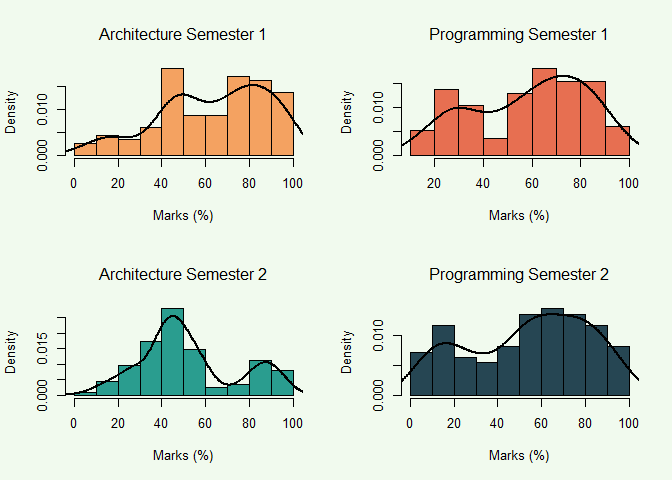
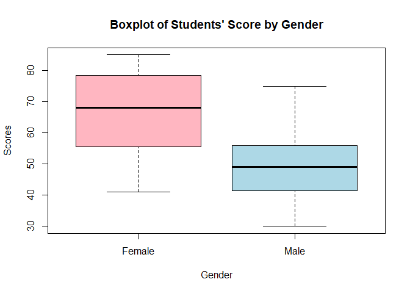

Dacanay_Jordan_R_FA1
================
Jordan Dacanay

# Importing results.csv

``` r
exam_results_data <- read.csv("results.csv", header=TRUE)
exam_results_data$gender <- as.factor(exam_results_data$gender)
attach(exam_results_data)
```

# Skewness Coefficient of the Four Examination Subjects

``` r
skew <- function(object) {
  x <- na.omit(object)
  xbar <- mean(x, na.rm = T)
  sum2 <- sum((x-xbar)^2, na.rm = T)
  sum3 <- sum((x-xbar)^3, na.rm = T)
  skew <- (sqrt(length(x))* sum3)/(sum2^(1.5))
  return(skew)
}


print(paste("Architecture 1:", skew(arch1)))
```

    ## [1] "Architecture 1: -0.512946249306507"

``` r
print(paste("Programming 1 :", skew(prog1)))
```

    ## [1] "Programming 1 : -0.333426526864521"

``` r
print(paste("Architecture 2:", skew(arch2)))
```

    ## [1] "Architecture 2: 0.448160046465879"

``` r
print(paste("Programming 2 :", skew(prog2)))
```

    ## [1] "Programming 2 : -0.301826930004153"

##### The distribution of students’ marks for the first semester in architecture and programming is moderately skewed to the left, indicating that most students scored relatively high. In the second semester, the distribution for architecture is moderately skewed to the right, while it remains moderately skewed to the left for programming. This suggests that most students scored relatively low in architecture, whereas the majority scored relatively high in programming. Overall, the students performed well, as the majority obtained relatively high scores in 3 out of the 4 subjects.

# Pearson’s Coefficient of Skewness

``` r
pearson_skew <- function(object){
  x <- na.omit(object)
  pearson_skew <- (3*(mean(x)-median(x))) / sd(x)
  return(pearson_skew)
}

print(paste("Architecture 1:", pearson_skew(arch1)))
```

    ## [1] "Architecture 1: -0.606904206669057"

``` r
print(paste("Programming 1 :", pearson_skew(prog1)))
```

    ## [1] "Programming 1 : -0.643228962747166"

``` r
print(paste("Architecture 2:", pearson_skew(arch2)))
```

    ## [1] "Architecture 2: 0.542128564908418"

``` r
print(paste("Programming 2 :", pearson_skew(prog2)))
```

    ## [1] "Programming 2 : -0.356290812560432"

##### To determine whether Pearson’s coefficient of skewness is a reasonable approximation, let’s display the four dataset through histogram.

# Graph of Score Distributions by Subject

``` r
arch1_clean = na.omit(arch1)
arch2_clean = na.omit(arch2)
prog1_clean = na.omit(prog1)
prog2_clean = na.omit(prog2)


par(mfrow = c(2,2), bg="#f1faee")
hist(arch1_clean, xlab ="Marks (%)",
     main = "Architecture Semester 1",
     font.main = 1, col = "#f4a261", probability = TRUE)
lines(density(arch1_clean), col="black", lwd=2)

hist(prog1_clean, xlab ="Marks (%)",
     main = "Programming Semester 1",
     font.main = 1, col = "#e76f51", probability = TRUE)
lines(density(prog1_clean), col="black", lwd=2)

hist(arch2_clean, xlab ="Marks (%)",
     main = "Architecture Semester 2",
     font.main = 1, col = "#2a9d8f", probability = TRUE)
lines(density(arch2_clean), col="black", lwd=2)

hist(prog2_clean, xlab ="Marks (%)",
     main = "Programming Semester 2",
     font.main = 1, col = "#264653", probability = TRUE)
lines(density(prog2_clean), col="black", lwd=2)
```

<!-- -->
\##### As shown in the figure above, it can be seen that the graph of
programming 1 and 2 are slightly similar yet Pearson’s coefficient of
skewness display a large difference between them. Additionally,
programming 1 display high curves in the right part but it somewhat
display a high curve on the left. Therefore, a skewness of -0.64 is not
a reasonable approximation as it programming 1 is not that highly skewed
to the left. Therefore, I could say that Pearson’s coefficient of
skewness is not a reasonable approximation.

# Data Storing of the Scores of 50 Students

``` r
females <- c(57, 59, 78, 79, 60, 65, 68, 71, 75, 48, 51, 55, 56, 41, 43, 44, 75, 78, 80, 81, 83, 83, 85)
males <- c(48, 49, 49, 30, 30, 31, 32, 35, 37, 41, 46, 42, 51, 53, 56, 42, 44, 50, 51, 65, 67, 51, 56, 58, 64, 64, 75)

# Gender vector
gender <- factor(rep(c("Female", "Male"), times = c(length(females), length(males))))

# Combine data into one vector
marks <- c(females, males)

# Create a data frame
df_marks <- data.frame(Gender = gender, Score = marks)
```

# Stem and Leaf Plot Students’ Score by Gender

``` r
# For males
stem(df_marks$Score[df_marks$Gender == 'Male'], scale = 0.5)
```

    ## 
    ##   The decimal point is 1 digit(s) to the right of the |
    ## 
    ##   3 | 001257
    ##   4 | 12246899
    ##   5 | 01113668
    ##   6 | 4457
    ##   7 | 5

``` r
# For females
stem(df_marks$Score[df_marks$Gender == 'Female'], scale = 1)
```

    ## 
    ##   The decimal point is 1 digit(s) to the right of the |
    ## 
    ##   4 | 1348
    ##   5 | 15679
    ##   6 | 058
    ##   7 | 155889
    ##   8 | 01335

##### As shown above, the scores’ distribution by gender can be easily presented using stem and leaf plot if the dataset is small. The curve and frequency are both displayed, providing all information needed to make an interpretation out of it. This is much more informative than a histogram since this graph displays general data and should just be used for large datasets.

# Boxplot of Students’ Score by Gender

``` r
boxplot(df_marks$Score ~ df_marks$Gender, data = df_marks, 
        col = c("lightpink", "lightblue"),
        main = "Boxplot of Students' Score by Gender", 
        xlab = "Gender", 
        ylab = "Scores",
        names = c("Female", "Male"))
```

<!-- -->
\##### The female boxplot shows that the interquartile range is
relatively close to the maximum value, indicating that is moderately
skewed to the left. The male boxplot on the other hand appears to be
somewhat symmetrical, indicating a normal distribution of scores. In
comparison, the female box plot indicates that the minimum and maximum
values, as well as the interquartile range, are greater than those of
the male box plot. This suggests that female students performed better
than male students.
